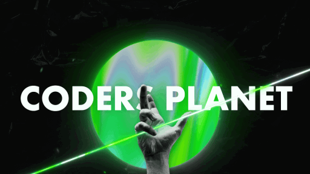

[]
[]
[]
[]

> **CodersPlanetHQ** — where creativity meets code.

---

## Table of Contents

- [About CodersPlanet](#about-codersplane)  
- [Services](#services)  
- [Our Team](#our-team)  
- [License](#license)  
- [Connect With Us](#connect-with-us)  

---

## About CodersPlanet

CodersPlanet is an open, collaborative community of developers, makers, and tech enthusiasts. From full-stack apps to handy snippets and boilerplates, we thrive on innovation and teamwork.

---

## Services

- **Projects**: Full applications, bots, and tools for real-world use.  
- **Snippets**: Bite-sized examples and functional code fragments.  
- **Libraries**: Robust, reusable modules and packages.  
- **Starters**: Boilerplates and templates to kickstart your builds.

---

## Our Team

| Member                                                                                                                                      | Role       | Profile                                                                                                           |
|---------------------------------------------------------------------------------------------------------------------------------------------|------------|-------------------------------------------------------------------------------------------------------------------|
|   | Developer  |  |
|  | Developer  |  |
|    | Developer  |  |

---

## License

Distributed under the MIT License. See [LICENSE](LICENSE) for details.

---

## Connect With Us

- [Discord](https://discord.gg/zZxncdkdWJ)  
- [YouTube](https://www.youtube.com/@CodersPlanet0)

> Keep learning. Keep shipping. Keep exploring.  
> — *CodersPlanetHQ Team*

